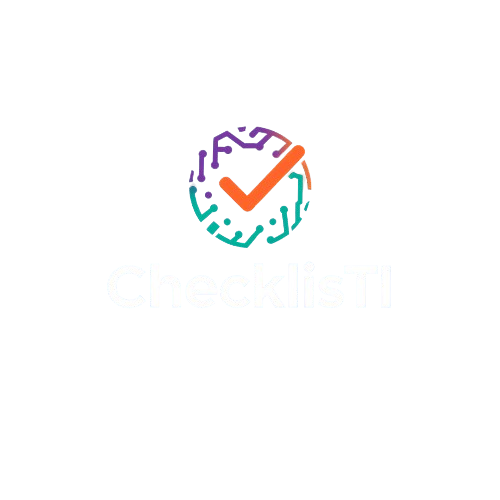

---

# ✅ ChecklisTI (Dockerized)


O **ChecklisTI** é uma aplicação web para **controle, acompanhamento e gestão do status de sistemas de TI** em empresas de qualquer porte.  

Com suporte a **Docker**, a aplicação pode ser executada em qualquer ambiente com um único comando, sem necessidade de configurar manualmente banco de dados ou dependências.

---

## 📂 Estrutura do Projeto

```
src/
├─ backend/            # API Node.js + Express
│  ├─ db.js            # Conexão com o banco de dados
│  ├─ package.json     # Dependências do backend
│  ├─ schema.sql       # Script SQL para criar banco e tabelas
│  ├─ server.js        # Ponto de entrada do servidor Node.js
│  ├─ routes/          # Rotas da API
│  └─ utils/           # Funções auxiliares
└─ frontend/           # Interface do usuário (HTML/CSS/JS)
   ├─ assets/          # Arquivos estáticos
   ├─ index.html       # Página principal
   ├─ script.js        # Scripts JavaScript
   └─ style.css        # Estilos CSS
```

---

## 🚀 Tecnologias Principais

- **Backend:** Node.js + Express  
- **Frontend:** HTML5, CSS3, JavaScript (VanillaJS)  
- **Banco de Dados:** MariaDB 11  
- **Infra:** Docker & Docker Compose  

---

## 🔧 Pré-requisitos

- [Docker](https://docs.docker.com/get-docker/)  
- [Docker Compose](https://docs.docker.com/compose/)  

---

## ▶️ Como rodar o projeto com Docker

1. **Clone o repositório**:
   ```bash
   git clone https://github.com/itsmemaikon/ChecklisTI.git
   cd ChecklisTI
   ```

2. **Suba os containers**:
   ```bash
   docker-compose up --build
   ```

   Isso irá:  
   - Criar e iniciar um container **MariaDB** com usuário, senha e banco definidos.  
   - Executar automaticamente o script `schema.sql` (apenas na primeira execução).  
   - Construir e rodar o container do **backend Node.js**.  
   - Servir o **frontend estático**.  

3. **Acesse a aplicação**:  
   - Backend (API): [http://localhost:3000](http://localhost:3000/api)  
   - Frontend: [http://localhost:3000](http://localhost:3000)  

---

## 🗄️ Banco de Dados

O banco roda dentro do container `checklistti_db`.  

**Configurações padrão** (definidas em `docker-compose.yml`):  
- **Host:** `db` (interno ao Docker) ou `localhost:3306` (externo)  
- **Database:** `ChecklisTI`  
- **User:** `checklistti_user`  
- **Password:** `checklistti_pass`  
- **Root password:** `rootpassword`  

Os dados são persistidos em um volume Docker chamado `mariadb_data`, não sendo perdidos ao reiniciar os containers.  

Para acessar o banco via terminal:
```bash
docker exec -it checklistti_db mariadb -u checklistti_user -pChecklisTI
```

---

## 📝 Fluxo de Desenvolvimento com Docker

1. Clone o repositório.  
2. Rode `docker-compose up --build`.  
3. Acesse a aplicação em [http://localhost:3000](http://localhost:3000).  
4. Edite o código no host → as mudanças refletem no próximo build.  

### Parar os containers:
```bash
docker-compose down
```

### Parar e apagar os dados do banco:
```bash
docker-compose down -v
```

---

## 🗂️ Licença

© 2025 ChecklisTI. Todos os direitos reservados.
